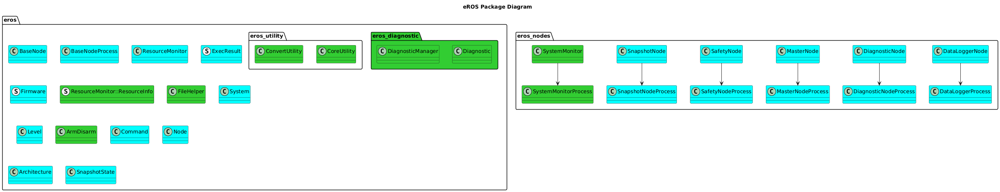

# EROS
[](https://github.com/dgitz/eros/actions/workflows/Release.yml)

__TOC__
- [ROS Version Support](#ros-version-support)
- [Overview](#overview)
- [Messages](#messages)
- [Features](#features)
- [Sister Repositories](#sister-repositories)
- [Compatability](#compatability)
- [Setup Instructions](#setup-instructions)
- [Usage Instructions](#usage-in-your-package)
- [Development Guide](#development-guide)
- [Test Plan](#test-plan)

Welcome to the EROS Wiki!


[Source Code Documentation](https://dgitz.github.io/eros/)

EROS is: "Enhanced ROS".  For more information on ROS, see: https://www.ros.org/ 

## ROS Version Support
eROS will target ROS Noetic for future releases.

eROS Support for ROS Melodic is limited.  Final planned release is [CAPTAINMARVEL02](https://github.com/dgitz/eros/releases/tag/CAPTAINMARVEL02) and code branch [melodic-devel](https://github.com/dgitz/eros/tree/melodic-devel)


## Overview

ROS is a great tool for developing software for robotics.  However there are definitely features lacking in ROS that I have encountered over the years, starting with my first forays into ROS Diamondback back in the day.  After more than 25 years of robotics development, I've found that the biggest hurdle with developing robots is knowing exactly what is going on with a robot (good or bad), in a timely fashion.  

The purpose of EROS is the following:

* Make developing robot software easier
* Make troubleshooting robot software easier
* Make robot software more resilient

## [Messages](doc/Messages/Messages.md)

## Software Design



## [Features](doc/Features/Features.md)


## Sister Repositories

  * [robot_dev](https://github.com/dgitz/robot_dev/wiki) 
  * [ros_hats](https://github.com/dgitz/ros_hats/wiki)
  * [ros_display_hats](https://github.com/dgitz/ros_display_hats/wiki)

I am very interested in what other people have to say about this project how they can integrate this into their applications.  Please let me know about any feature requests, bugs, etc that you encounter.  

## Compatability
This package is currently compatible with the following architectures:
* Any x86/64 compatible system
* AArch Linux (such as a Jetson Nano)
* ARM7L (such as Raspberry Pi 2 or 3)

There are currently only a few features of eROS that actually need to be compatible with these architectures:
  * Resource Monitor

If you would like to use this in your project on an architecture that is not currently supported (but is still ROS compliant), let me know and I'll see what I can do to help.

Installation instructions for each of these supported device types are on the side, under [Device Deployment](https://github.com/dgitz/eROS/wiki/Device-Deployment).

## Setup Instructions
### x86
For x86 Setup, perform the following:
1. Follow the typical ROS Noetic install instructions: http://wiki.ros.org/noetic/Installation/Ubuntu
1. Go to your workspace/src folder and clone eROS: \
  `git clone https://github.com/dgitz/eros.git`
1. Run the Auto Setup Script: `cd eros && python3 scripts/simple_setup.py`
1. Go back to your workspace directory
1. Install all dependencies, build eROS and run unit tests.\
  `rosdep install eros`\
  `catkin_make` \
  `catkin_make run_tests_eros`
1. Setup [ROS Network Environment](https://wiki.ros.org/ROS/NetworkSetup).

### Other Targets
For other targets, follow [Device Deployment](doc/Development/DeviceDeployment.md)


## Usage in your Package
Update your package CMakeLists.txt:
```
find_package(catkin REQUIRED COMPONENTS
...
  eros
...
)
```

Update your package.xml:
```
<depend>eros</depend>
```
OR
```
<build_depend>eros</build_depend>
```

## [Development Instructions](doc/Development/DevelopmentInstructions.md)

## [Test Plan](doc/TestPlan/TestPlan.md)