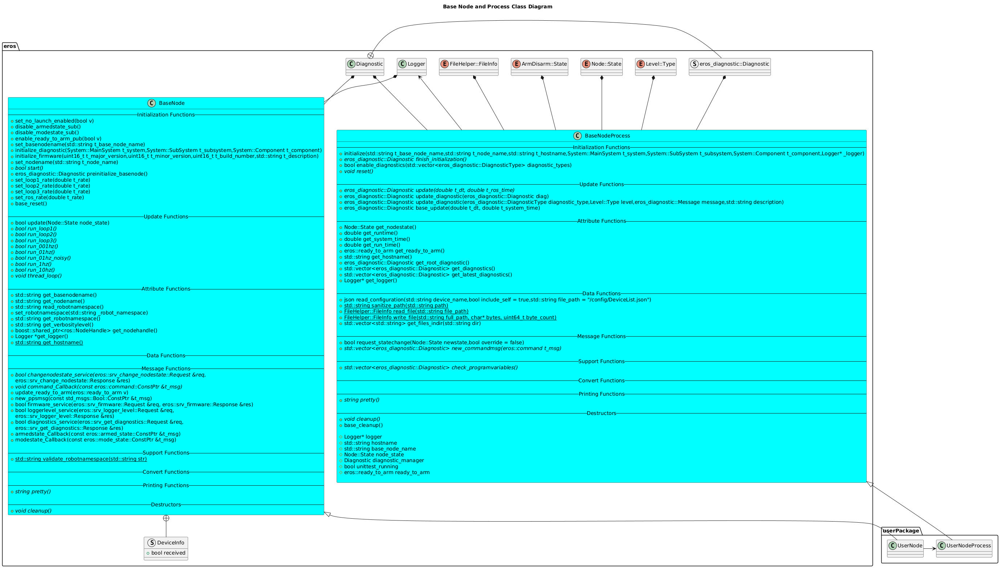

[Features](../Features.md)

# Base Node
## Overview
The eros Base Node is a derivable Node that adds a lot of functionality to your Nodes.

## Software Design


### Class Diagrams


## Features
* [Common Messages and Services](BaseNodeMessagesServicesActions.md)
* Diagnostic Handler: Enable Diagnostics for different Diagnostic Types.  Software can update a specific diagnostic without losing context to other diagnostics.  For example, if a node is executing (DiagnosticType=SOFTWARE), it can just be at an INFO level.  But if the node is having trouble communicating with a sensor (DiagnosticType=SENSORS) that diagnostic can be at a WARN level.  Both of these diagnostics (and more) can be set at the same time.
* Timing Loops: Has multiple timing loops that can be used to execute user-defined content at regular intervals.  Includes Loops at rates:
  * 10 Hz
  * 1 Hz
  * .1 Hz
  * Noisy .1 Hz (When system is time sync'd, all all timing loops will run at the same time and rate.  This can lead to problems when multiple processes are executing content at the same time causing brief high CPU usage.  This loop runs at .1 Hz with a random time offset to alleviate this problem.
  * .01 Hz
  * 3 User configured Loop Rates (Loop1, Loop2, Loop3)
* Instantiating Logger
* Continuously publishes a Node Heartbeat
* Instantiating a Node Process (user defined code that can be more readily unit tested without the ROS message framework involved).
* Uses Interrupt Handlers to kill node (no more hanging node executions when you hit Ctrl-C!)
* Run Node defined Unit Tests while Node is running!  Can be used for troubleshooting.
* Reports Resource Usage of a Node (CPU, RAM in perc)
* Request diagnostics active on a Node
* Request current Firmware version
* Change Logger Level
* Request Node State Change

## Node State Progression
The Base Node progresses through different states to aid in proper context management.  The following illustrates the allowed Node::State Transitions.


In order for an eros Custom Node to support this, the following must be supported in the Custom Node:
```code
bool changenodestate_service(eros::srv_change_nodestate::Request &req,
                             eros::srv_change_nodestate::Response &res);
```

## Usage Guide
### Call Order for Initialization
When using the BaseNodeProcess and the BaseNode, the proper call order is as follows:

NOTE: The following code will not compile, this is for illustrative purposes.

```
SampleNode *node = new SampleNode();  // Instantiate the Node
bool status = node->start(argc, argv);  // Call the Node Start Function (user provided, should follow a template)

start(...) {
  initialize_diagnostic(...) // Set the Root Diagnostic
  process = new SampleNodeProcess();  // Instantiate the Node Process
  initialize_firmware(...) // Set the Firmware Variables
  preinitialize_basenode(...) // Run pre-initialize Node content.  
  read_launchparameters()  // Node specific configuration 
  process->initialize(...)  // Initialize the Node Process
  process->enable_diagnostics(...) // Enable configured Diagnostic Types
  process->finish_initialization() // Finish initialization of the process
  finish_initialization() // Any other initialization that needs to happen at the end.
  request_statechange(Node::State::INITIALIZED);
  return;
}

preinitialize_basenode(...) {
Includes:
 * Initializing the ROS Node Handle
 * Node Heartbeat
 * Getting the hostname
 * Getting logger level from config
 * Getting loop rates from config
 * Setting up base node pubs, subs, service clients, etc.
}

read_launchparameters() {
Includes: 
 * Read node specific configuration values loaded from launch file.
 * Read node specific configuration values from other config files.
}
```
