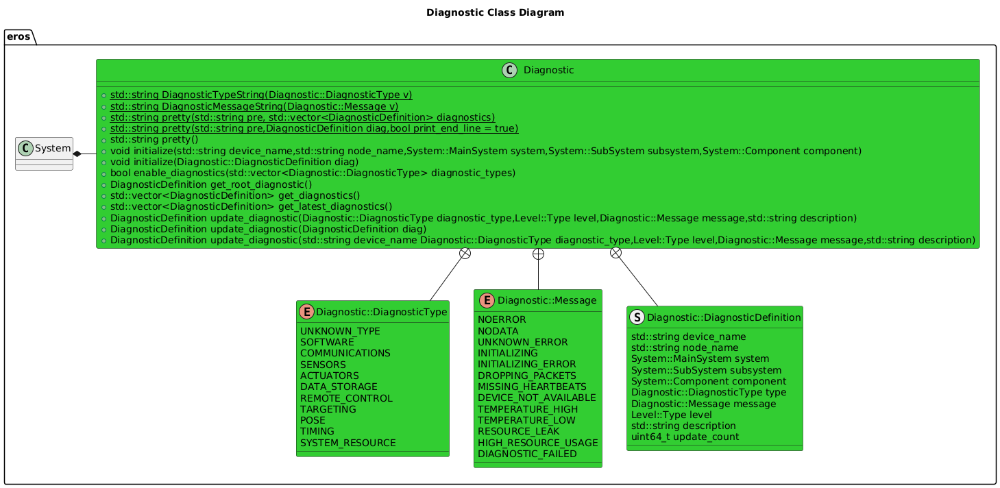

[Features](../Features.md)

# Diagnostics

## TOC
- [Diagnostics Overview](#overview)
- [Diagnostics Philosophy](#eros-diagnostic-philosophy)
- [Structure](#diagnostic-structure)
- [Software Design](#software-design)
- [Examples](#examples)
- [Future Feature List](#future-feature-list)

## Overview
Diagnostics seem to be more of an after-thought when developing typical ROS applications.  In EROS, Diagnostics are front and center.

Diagnostics are useful for the following reasons:
* Function return type: If you write a really cool function to process some data, and the function isn't able to process the data the way you envision, how do you tell the caller what happened?  If you only return a true/false, you lose all context to why that function failed.  If you print out the message to a console window, what happens when you aren't actively monitoring the console?  Of course you can return your own unique parameter, such as an int.  Sometimes a function return might be valid if it returns a "0" value, or sometimes it can be valid for a "1".  Therefore we need a much stronger datatype that can be used and standardized across an application.
* Logging: Human readable and actionable diagnostics are a primary concern in robotics.  How do you know when your thing isn't working?  What should you do if it's not working?  Simply printing out error cases to a console window just won't do.
* System Monitoring: An easy to use dashboard to see how well a system is performing would be useful.  There are various tools already in ROS, but they have very limited use case support.
* How do you design your system from the ground up to be easy to troubleshoot?  Often times in robotics research that aspect tends to get pushed back for future development, but then adding this functionality later on can involve a huge software tear-up.  Why not integrate it from the start?

Applications may also have their own use cases for diagnostics:
* Arming/Disarming a robot automatically.
* Generating error codes that can be tied back to malfunctioning Hardware.

## EROS Diagnostic Philosophy
* Should not require ROS
* Diagnostics are NOT to be used as a heartbeat.  Diagnostics should only be generated on an as-needed basis, as they may contain a large amount of data.
* Diagnostics should be enabled on a node by node basis.  
* Diagnostics should only be transmitted on change (or requested).  Diagnostics should not be continually published when their data does not significantly change.
* A Node may report 0, some or diagnostics for every diagnostic type.
  * Prefer to have every Node report the following Diagnostic Types (but not required): SOFTWARE,COMMUNICATIONS,DATA_STORAGE,SYSTEM_RESOURCE

## Diagnostic Structure
The following data should be common across all diagnostics defined on a single node:
  * Device Name
  * Node Name
  * System
  * Subsystem
  * Component

Multiple Diagnostics can be enabled on a Node.  These diagnostics will have the following additional fields:
  * Diagnostic Type
  * Level
  * Message
  * Description

More information can be found at [eros::Diagnostic Class Reference](https://dgitz.github.io/eros/classeros_1_1Diagnostic.html).

## Software Design


### Class Diagrams


## [Diagnostic Node](DiagnosticNode.md)
A node that listes to all diagnostics and aggregates them.

## Examples
### Node Initialization
The following illustrates how to initialize an EROS Node to attach a Node to a Diagnostic System, Subsystem, and Component.

```code
  process->initialize(...,
                        DIAGNOSTIC_SYSTEM,
                        DIAGNOSTIC_SUBSYSTEM,
                        DIAGNOSTIC_COMPONENT,
                        ...);
```

The following illustrates how to enable diagnostics for specific Diagnostic Types.

```code
  std::vector<Diagnostic::DiagnosticType> diagnostic_types;
  diagnostic_types.push_back(Diagnostic::DiagnosticType::SOFTWARE);
  diagnostic_types.push_back(Diagnostic::DiagnosticType::DATA_STORAGE);
  diagnostic_types.push_back(Diagnostic::DiagnosticType::SYSTEM_RESOURCE);
  diagnostic_types.push_back(Diagnostic::DiagnosticType::COMMUNICATIONS);
  process->enable_diagnostics(diagnostic_types);
```

### Update a specific Diagnostic Type
The following illustrates how to update a specific Diagnostic Type.  This will over-write the current Diagnostic Type with this new information.

```code
 diag = process->update_diagnostic(Diagnostic::DiagnosticType::DATA_STORAGE,
                                      Level::Type::INFO,
                                      Diagnostic::Message::NOERROR,
                                      "All Configuration Files Loaded.");
```

### Instantiate a new Diagnostic
The following illustrates how to instantiate a new Diagnostic.

```code
 Diagnostic::DiagnosticDefinition diag("Device1",
                                        "Node1",
                                        System::MainSystem::ROVER,
                                        System::SubSystem::ROBOT_CONTROLLER,
                                        System::Component::COMMUNICATION,
                                        Diagnostic::DiagnosticType::REMOTE_CONTROL,
                                        Diagnostic::Message::INITIALIZING,
                                        Level::Type::WARN,
                                        "Msg1");
```

### Log a Diagnostic
The following illustrates how to log a diagnostic.  Note that the Logger will only log a diagnostic if the diagnostic level is equal or higher than the current logger threshold level.

```code
if (diag.level > Level::Type::NOTICE) {
        logger->log_diagnostic(diag);
}
```


## Future Feature List
* Diagnostic Aggregator: Collects diagnostics on system and aggregates on Diagnostic Type.
* Integrate with ROS Diagnostics: http://wiki.ros.org/diagnostics
