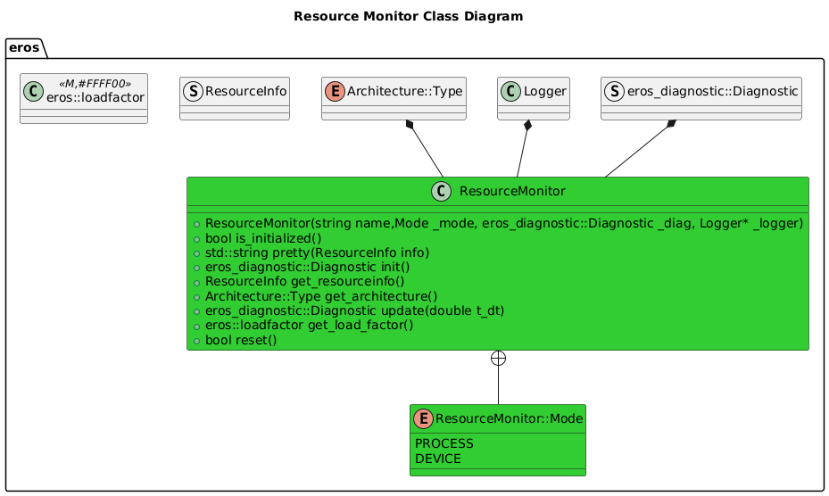

# Resource Monitor

## Overview
The Resource Monitor provides the capability of monitoring resources used and resources available per Node and per Device.

## Features

## Software Design

### Class Diagram

