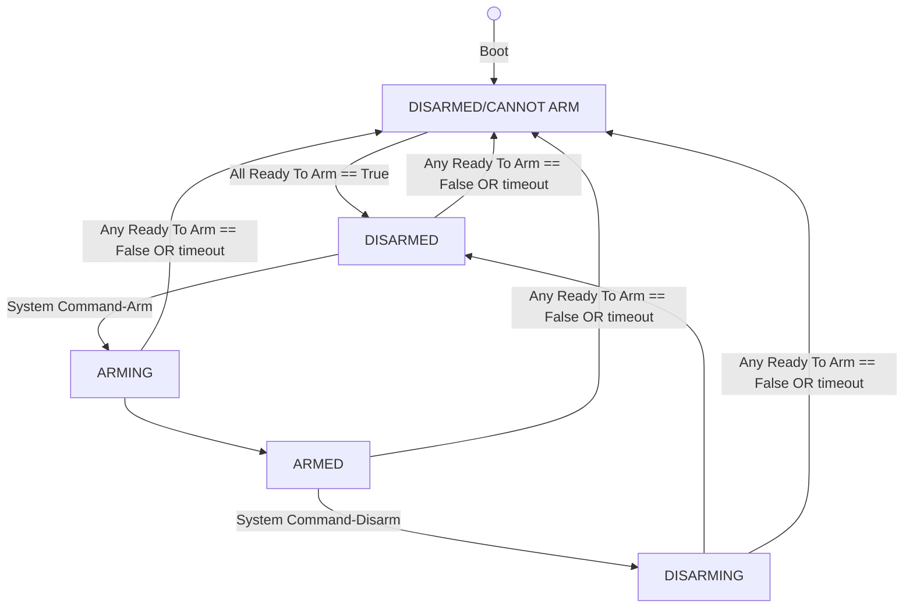

# Arm & Disarm

## Overview

The purpose of the Arm/Disarm logic is to disable defined actuators/set default values on those actuators when the system is NOT in an "ARMED" state.

## Configuration
- To enable the Default Ready To Arm ROS Publisher, enable the Publisher before the call to "preinitialize_basenode" via: `enable_ready_to_arm_pub(true);`
- The Safety Node needs to be configured and running.  See: [Safety Node](../SafetyControl/SafetyNode.md)

## Operation
The following state machine describes the operation of the Arm/Disarm Logic:

1. Boot: System is: "DISARMED/CANNOTARM"
2. Safety Node monitors all ready to arm signals.  When all ready to arm signals are "True", Safety Node will change node to "DISARMED".
3. When a System Command is received to "ARM", the Safety Node will transition to "ARMING" and then "ARMED".
4. When a System Command is received to "DISARM", the Safety Node will transition to "DISARMING" and then "DISARMED".
5. If at any time any of the Safety Node Ready to Arm Monitors change to "False", the Safety Node will change state to "DISARMED/CANNOT ARM".  
6. If at any time any of the Safety Node Ready to Arm Monitors "timeout" by not receiving a signal (current limit is 5 seconds), the Safety Node will change state to "DISARMED/CANNOT ARM".
7. If the system is in "DISARMED/CANNOT ARM", it will not change state at all until those conditions are rectified.
## States

### DISARMED-CANNOT ARM
- Default State at Boot

### DISARMING

### DISARMED

### ARMING

### ARMED