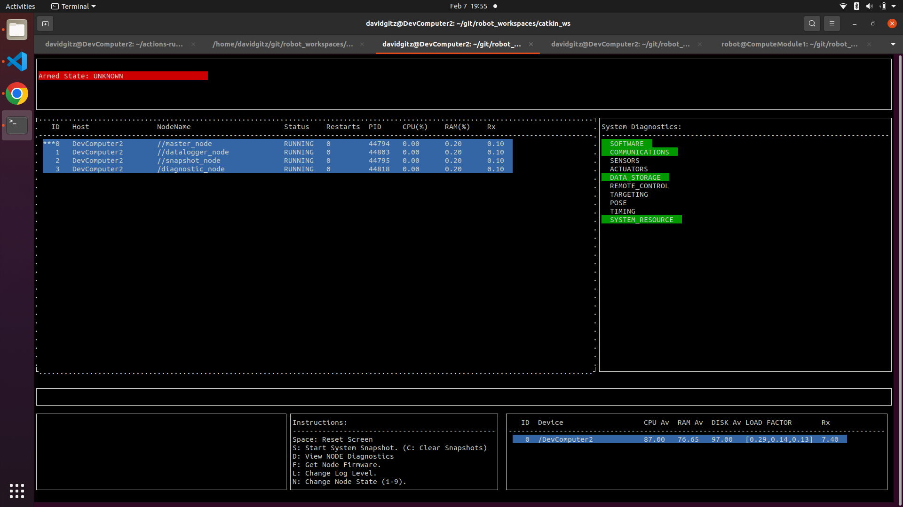
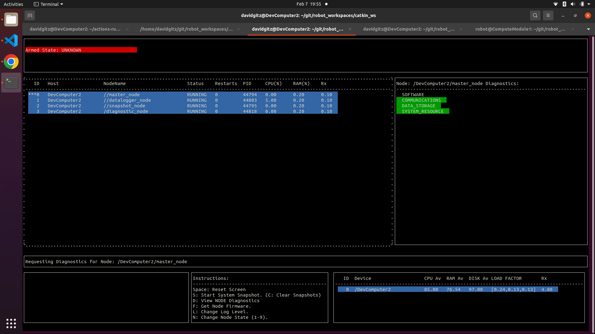

[Features](../Features.md)

# System Monitor

## Overview
The EROS System Monitor is a nice tool to aid in viewing different aspects of a ROS system.

## Features
The following features are currently supported:
* View active nodes (EROS nodes have more info, regular ROS nodes will also show up though).
* View when the node was last able to be pinged/received a heartbeat from.  Note that if the System Monitor is started after a node has shutdown, it will not see it.
* Node will change color based on its current operation state.
* Node will show PID, CPU and RAM Used (in perc)
* System Monitor is still an EROS Node, so all output file information is available.
* Select Task (up/down) and perform the following:
  * View Node Diagnostics (eros Nodes Only). Press "D".
  * View Node Firmware version (eros Nodes Only). Press "F". 
  * Change Node Log Level (eros Nodes Only). Press "L" and then press 1-6 (DEBUG-FATAL).
  * Change Node State (eros Nodes Only). Select "N" and then press 1-9 (INITIALIZING-CRASHED).
* View Device Information (only for Devices running the eros Master Node)
  * Shows Available CPU, RAM and Disk (in Percentage)
  * Shows Device Load Factor (scaled by number of processors on the device) in 1, 5 and 15 min bins.
* Request System Snapshot (System Snapshot is made up of individual Device Snapshots).
* View Aggregate of System Diagnostics (press "D" to toggle Task/System mode).
* View Info based on a specified robot namespace

More detailed information can be found in the [System Monitor Documentation](../../../nodes/SystemMonitor/doc/SystemMonitorNode.md).
