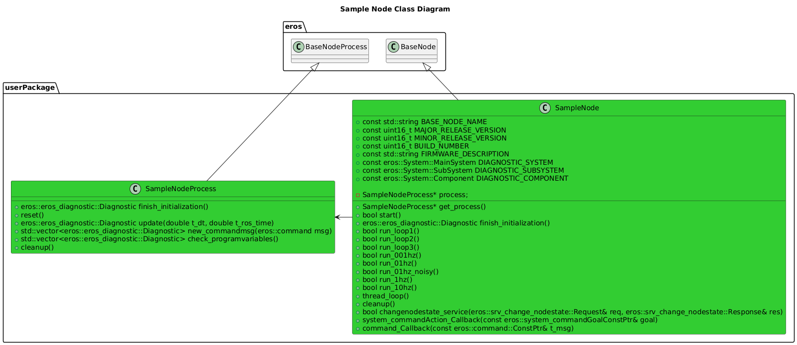

[Features](../Features.md)

# Templates

## Overview
eros provides a few different templates that can be used to create nodes and classes that use all the eros functionality.  

## Software Design

### Class Diagrams


### Sequence Diagrams


## Usage
### Setup
To use these you will need to install cookiecutter at the following:  https://cookiecutter.readthedocs.io/en/1.7.2/installation.html

### Usage
Inspect what templates are currently available and determine if these will fit your application needs.  These include:\
**EROS-CLASS** (auto_template/class)\
**EROS-NODE** (auto_template/node)

To create content from a template, simply use the script: ```python scripts\create_from_template.py``` and follow the prompts.
After the generation of the content is complete, instructions will automatically be provided (or can be viewed in the template under "ExtraInstructions.md") so that you can use this new content in your package.
