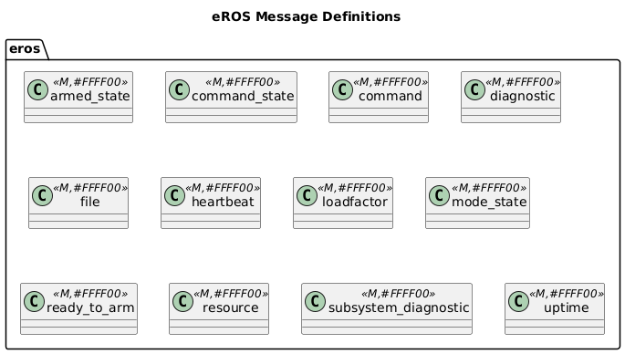

EROS Defines some new ROS Messages.  These are:

# Command
A message to be used to command various actions to perform.

# Diagnostic
A message to be used for diagnostic collection.

# Heartbeat
A message to be used as a Node Heartbeat that can be monitored for keep-alive reasons.

# Resource
A message to be used for resource usage, including: RAM, CPU and Disk Utilization.

# Subsystem Diagnostic
A message to be used for diagnostic aggregation at a subsystem level.

# Uptime
A message to be used to keep track of how long a device/system has been running.