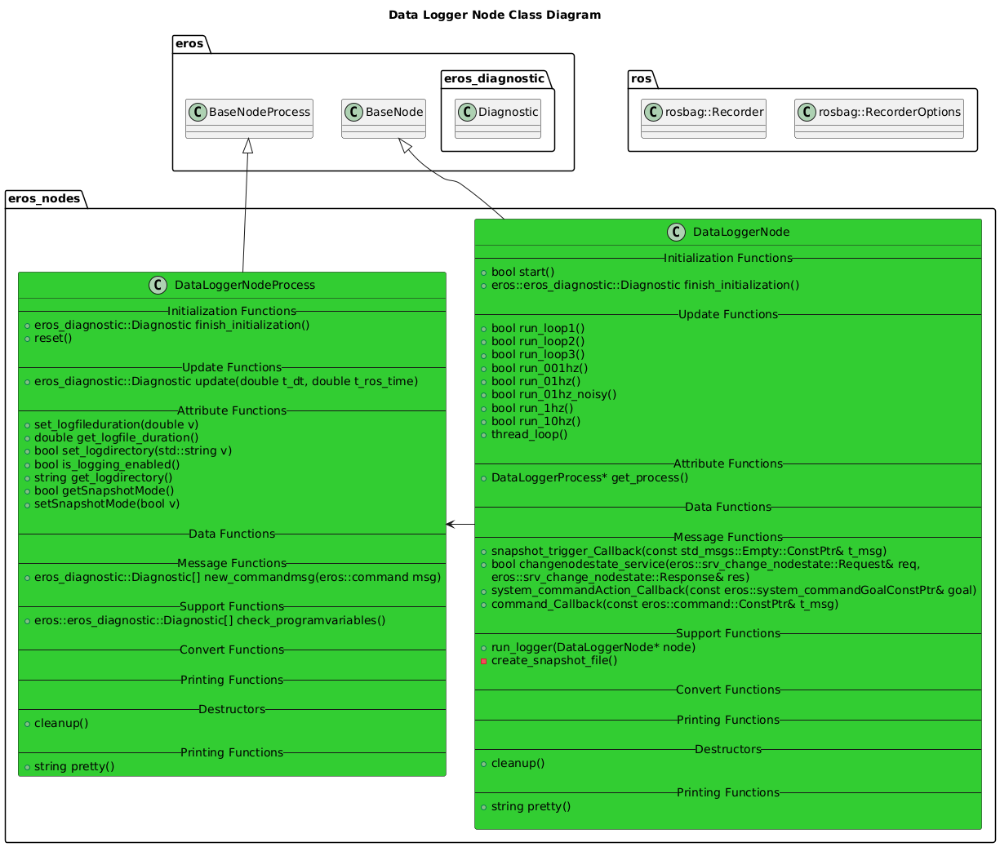

# Data Logger Node

## Overview
The Data Logger Node wraps the ROS Bag Recorder API in a more friendly node.  

## Features
- No-Snapshot Mode: Will always write to disk.  
- Snapshot Mode: Only writes to disk when the topic `/snapshot_trigger` is triggered.  Note: This can eat up a large amount of RAM, especially with large ros data traffic.
- Snapshot file is created when trigger is generated, which includes information about the snapshot.
- Configurable directory where bag files are stored.

## Configuration
The following configuration items are used for this Node:

```xml
<param name="LogFile_Duration"      value="600.0"/>
<param name="LogFile_Directory"     value="~/storage/DATALOGS/"/> 
<param name="SnapshotMode"          value="true"/>
```

## Software Design


### Class Diagrams


### Sequence Diagrams


## Troubleshooting