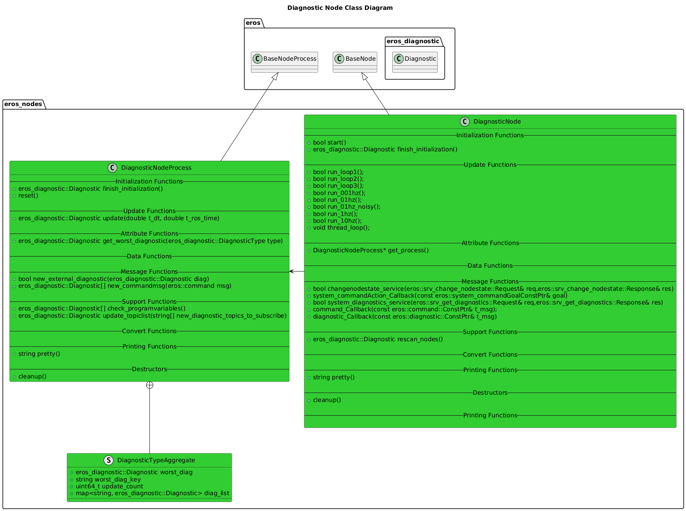
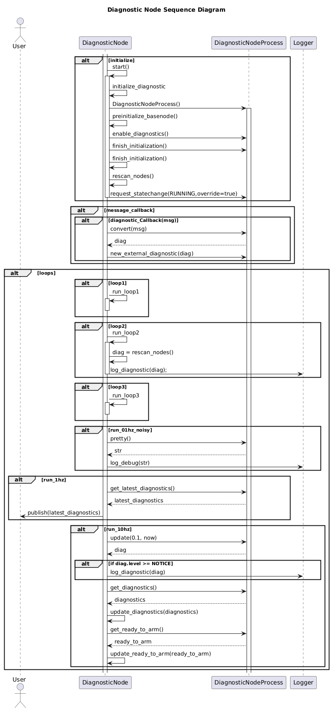

# Diagnostic Node

## Overview
The Diagnostic Node listes to all diagnostics on a system and aggregates them.

## Features
* Polls other nodes for diagnostics and keeps track of what are the worst diagnostics for each diagnostic type.
* Responds to diagnostic service for system diagnostics (System Monitor can view these).

## Configuration
* 1 Instance of the diagnostic_node should be run PER System.

## Software Design

### Class Diagrams

### Sequence Diagrams

## Troubleshooting

## Future Features