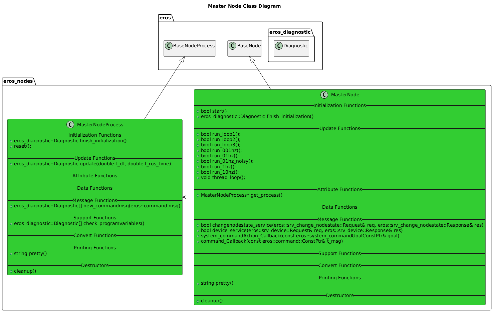
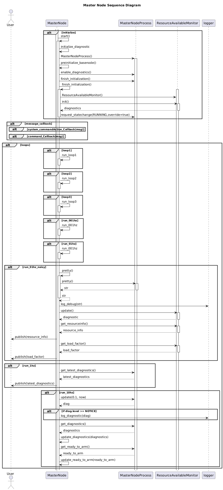

# Master Node

## Overview
The Master Node provides a master coordinating capability for ROS environment.

## Features
The Master Node performs the following:
* Reads device info.
* Creates a service to pass this device info to other nodes.
* Reports device resource usage availability (individual nodes report their resource usage, the master reports what's left).
* Reports device load factor values (1,5 and 15 min)

## Configuration
- 1 Master Node should be ran on each device in an EROS compatible system.  No special configuration is required for the Master Node.

## Software Design

### Class Diagrams

### Sequence Diagrams

## Troubleshooting