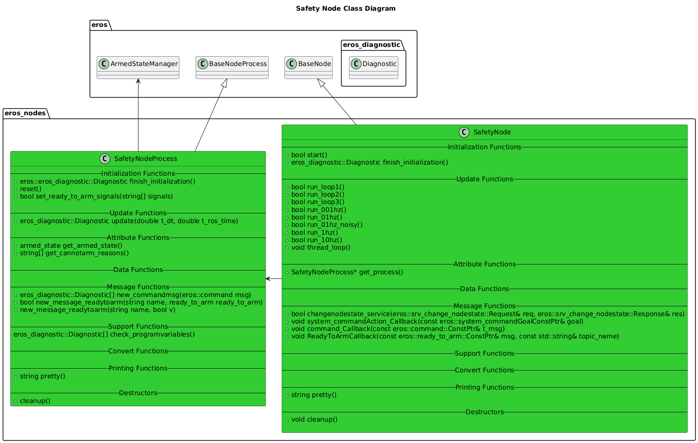
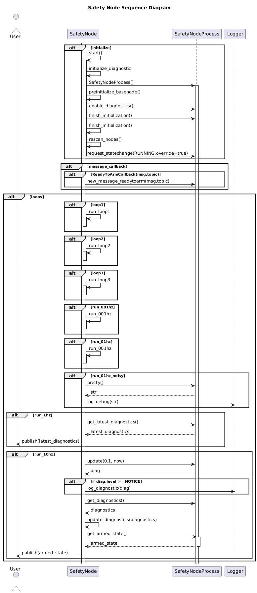

# Safety Node

## Overview

## Features

## Configuration
In the node launch file, add the following entries to have the Safety Node monitor topics to inform the arm/disarm system.
* Note that the number indicated in the _000 field should increment on each new topic, regardless of what type it is.
* At least 1 Topic is required for the system to go from DISARMED_CANNOTARM to DISARM.

#### Topics of type eros/ready_to_arm
 `<param name="ReadyToArm_Topic_000"   value="<TOPIC NAME>"/>`\
 `<param name="ReadyToArm_Topic_001"   value="<TOPIC NAME>/>`\
  ...

Note that only 1 instance of the Safety Node should be run per system.

## Software Design

### Class Diagrams

### Sequence Diagrams

## Troubleshooting

## Future Features

### Features
* Deciding the Armed State of the System

