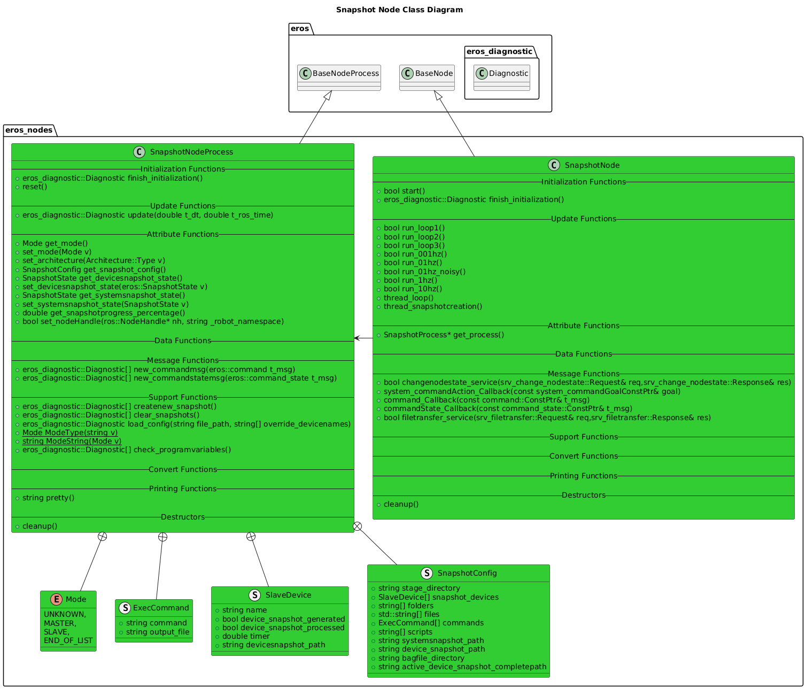

# Snapshot Node

## Overview
The Snapshot Node provides the capability to capture various information on demand that can be useful for development, debugging, etc.

## Features
- Supports "Device Snapshots" and "System Snapshots".  As a robot may include multiple devices, each device can generate a snapshot, and the System Snapshot is the combined snapshot of the entire system.
- System Commands: A configuration file is available that includes running arbitrary commands on each device and logging the relevant output.  For example, you can look at CPU performance (`top -bn1`), Get the latest syslog report, get a list of all processes running (`ps aux`), etc.
- Files/Folders: A configurable list of files and/or folders is available that will dump whatever contents are in these into the device snapshot.
- Architecture Support: The configuration to define what commands, files, and folders to include in the device snapshots is defined at the Architecture level, as typically different platforms can put files in diffrent locations on the file system, have different command line support, etc.
- The System Snapshot includes ROS bags that are snapshotted themselves, which allows only storing bags when events occurred.  NOTE that this requires running the Data Logger Node.

## Configuration
### Node Configuration
An instance of the Snapshot Node should be run on each device in the ROS System.
There should be 1 Master Snapshot Node and multiple Slave Snapshot Nodes.  Note that the Master Snapshot Node should be run on the same device as the Data Logger Node.  The specific configuration for the Master instance is:
```xml
<param name="Mode"              value="MASTER"/> <!-- MASTER,SLAVE-->
<param name="Config_Directory" value="~/config"/> <!-- Where the Snapshot.xml file is located -->
```

And the specific configuration for each Slave instance is:
```xml
<param name="Mode"              value="SLAVE"/> <!-- MASTER,SLAVE-->
<param name="Config_Directory" value="~/config"/> <!-- Where the Snapshot.xml file is located -->
```

### Snapshot Configuration
In the Snapshot Config xml file, add all the devices that should report a device snapshot:
```xml
<SnapshotConfigFile>
    <SnapshotConfig>
        <SnapshotDevices>
            <Device>DevComputer1</Device>
            <Device>DevModule1</Device>
            <Device>BuildServer1</Device>
            <Device>ControlModule2</Device>
            ...
        </SnapshotDevices>
        <BagFileDirectory>~/storage/DATALOGS/</BagFileDirectory> <!-- Where Bag files are stored -->
        <StageDirectory>~/storage/stage/</StageDirectory>  <!-- Snapshot Node will create sub folders here freely!  -->
        <SystemSnapshotPath>~/storage/SNAPSHOT/SYSTEMSNAPSHOT/</SystemSnapshotPath> <!-- Where System Snapshots will get stored. -->
        <Architecture type="X86_64"> <!-- Architecture Specific Config -->
            <DeviceSnapshotPath>~/storage/SNAPSHOT/DEVICESNAPSHOT/</DeviceSnapshotPath> <!-- Where Device Snapshots will be stored. -->
            <Command file="ps_log">ps aux</Command> <!-- System Commands to be executed and stored in Device Snapshot. Add as many entries as needed. -->
            <Folder>~/var/log/output/</Folder> <!-- Folders to copy into Device Snapshot. Add as many entries as needed. -->
            <File>/var/log/syslog</File> <!-- Files to copy into Device Snapshot. Add as many entries as needed. -->
        </Architecture>
    </SnapshotConfig>
</SnapshotConfigFile>
```


## Software Design


### Class Diagrams


### Sequence Diagrams


## Troubleshooting