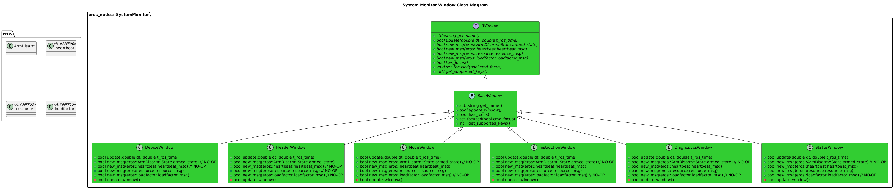
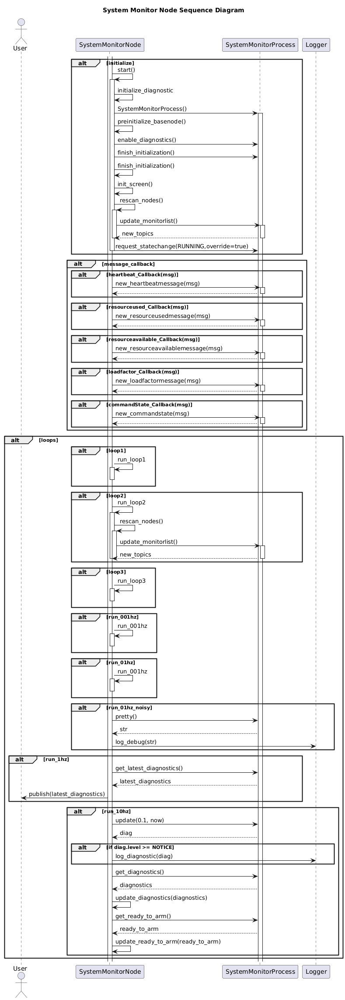

# System Monitor Node
For more information on the System Monitor, see [System Monitor Feature](../../../doc/Features/SystemMonitor/SystemMonitor.md)

# Software Architecture
## Class Diagrams

## Sequence Diagrams

