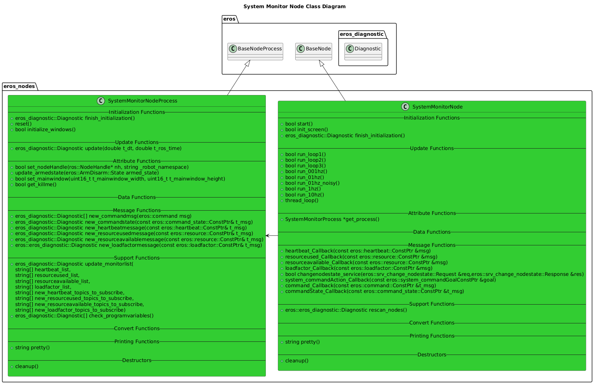

# System Monitor Node
For more information on the System Monitor, see [System Monitor Feature](../../../doc/Features/SystemMonitor/SystemMonitor.md)


## Usage Instructions:
After building the eros application, simply run:
```
rosrun eros system_monitor # With no __ns, will use a root namespace.
rosrun eros system_monitor __ns:=<NAMESPACE> # Run in a namespace, only monitors on this namespace.
```

## Configuration
There is no configuration required for typical usage of the System Monitor.

# Software Architecture
## Class Diagrams




## Sequence Diagrams

